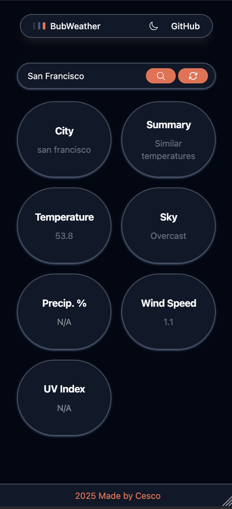
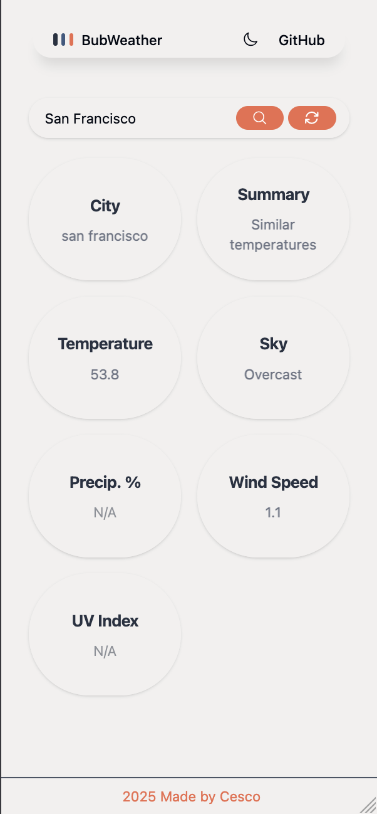
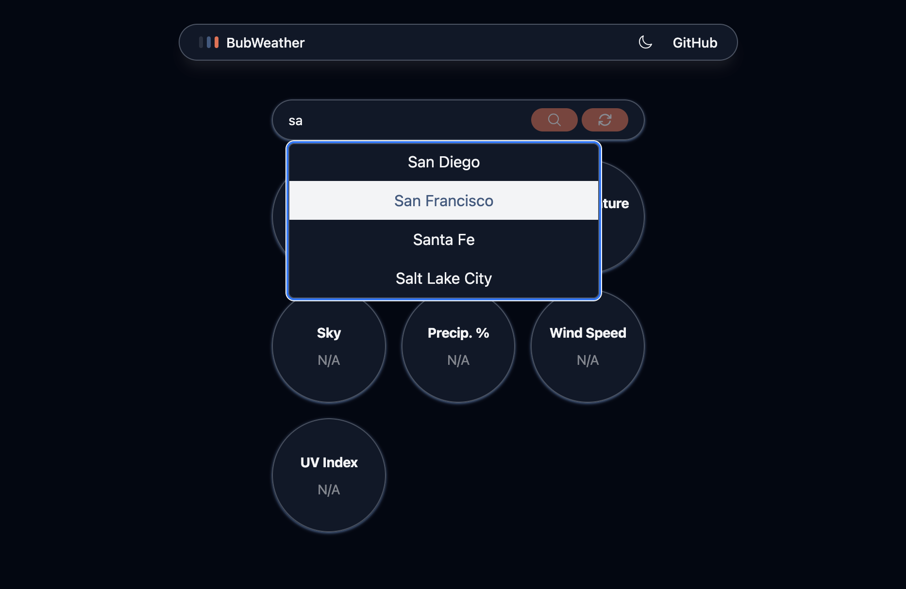
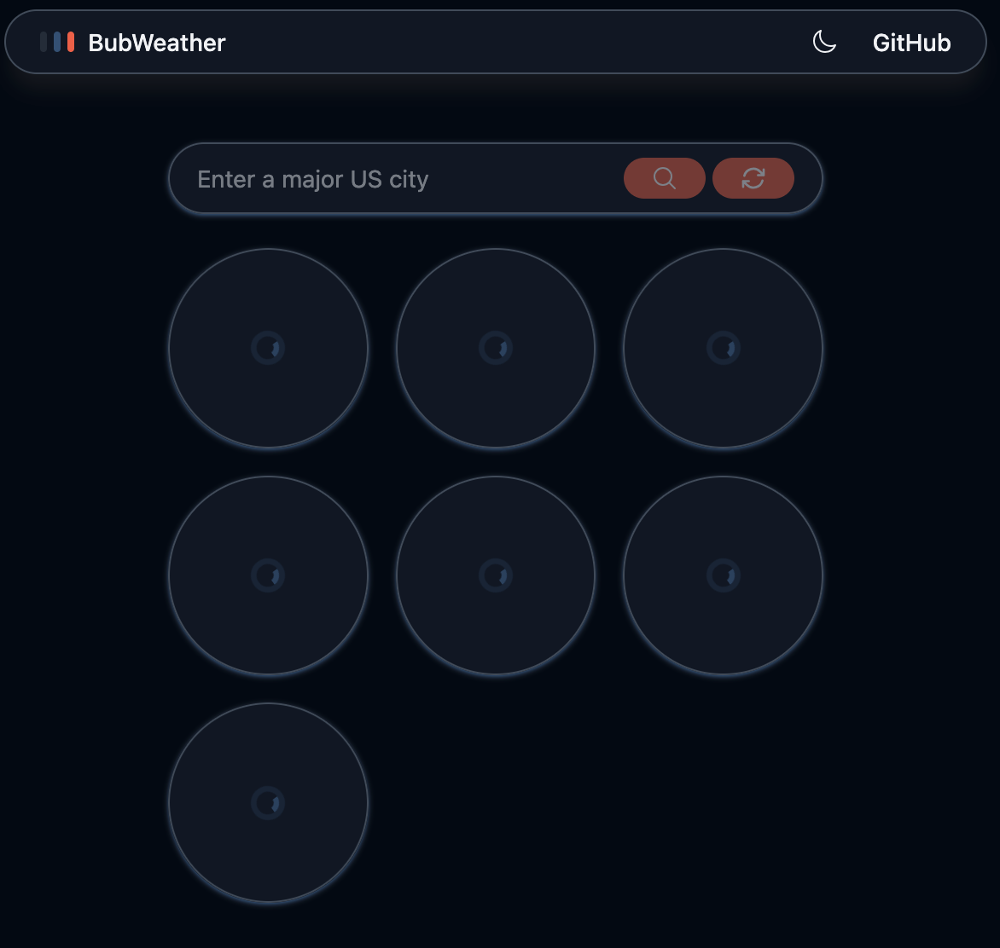

# BubWeather, straightforward weather in little bubbles

BubWeather is a simple straightforward mobile-first weather app demo that can search a major US city and return weather information for that city in little bubbles.
[project from roadmap.sh](https://roadmap.sh/projects/weather-app). Easy to use and accessible weather information based on the project from roadmap.sh!
<br>
<br>
Live Demo: https://bubweather.pages.dev/

## How it was made:

**Tech used:** 
- Framework: React
- Build Tool: Vite
- Styling: TailwindCSS, CSS
- State Management: Jotai
- API: Visual Crossing for weather data
- Other: 
  - HeroIcons for search and refresh icons

## Visual Examples
<br> Mobile Layout, Dark Mode <br>



<br> Mobile Layout, Light Mode <br>



<br> Desktop view, suggestions <br>



<br> Desktop view, loading state <br>



## How To Run The Project

1. Download or clone the repo onto your local environment, and navigate into the folder
```
git clone https://github.com/cescosgames/bubweather
cd bubweather
```
2. Install dependencies
```
npm install
```
3. Run the dev server
```
npm run dev
```
4. Go to your selected local host in your browser (Vite default is 5173)
5. *NOTE* Remember to input your own API key into the weathermanager component to ensure your requests succeed!

## Features:

Following the project guidelines, this project features...
1. User ability to enter a location into an input field
2. User presented with temperature, wind speed, likelihood of rain, and general weather after searching for inputted location
3. Refresh options
4. Full keyboard navigation

## Lessons Learned:

This was a nice project to practice working with 3rd party API's and continue refining react skills. I didn't implement any big new concepts and this felt mostly like
solid practice. This project's final version feels more like a demo than my other projects because, to limit API calls, I took some 'shortcuts'. For example, my custom suggestion
dropdown uses a small list of US cities from a json file I created, rather than calling from a larger more robust US city API. The framework is there though to implement it
if in the future I decided to expand on this project.
<br>
Speaking of the future, I initially had no idea what I wanted to present with this project but near the end I realized a 'bubble wrap' style presentation would have been awesome.
The idea being that you could add and remove 'bubbles' that contained information to the grid. Unfortunately, since I had already spent more time than I had planned on this 
project, I was unable to finish this idea and just presented a default view of 'bubbles'. With more time, I would go back and add the modular weather bubbles.
<br>
As a final note, this project is more lightweight compared to the other frontend projects in terms of features, and this is due to time constraints and lots of experimenting.
I spent more time than I had budgeted and experimented more than I anticipated with this project. It was fun, but ultimately I needed to wrap this project up as is which
is why this version is more feature-light than maybe I had planned.